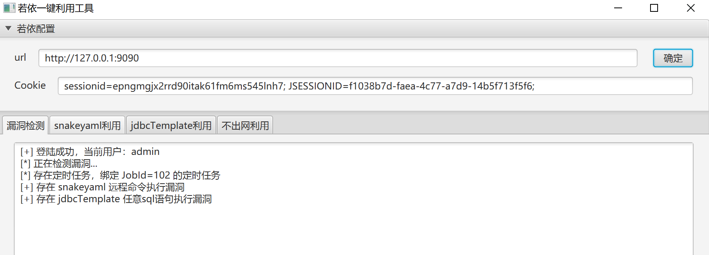
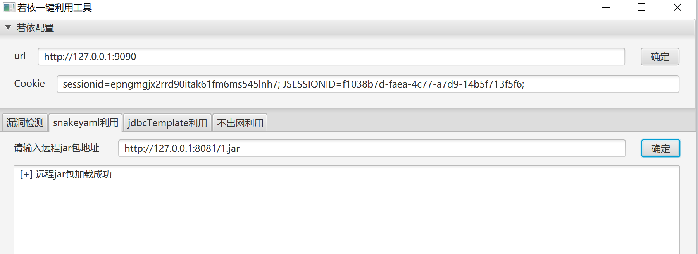
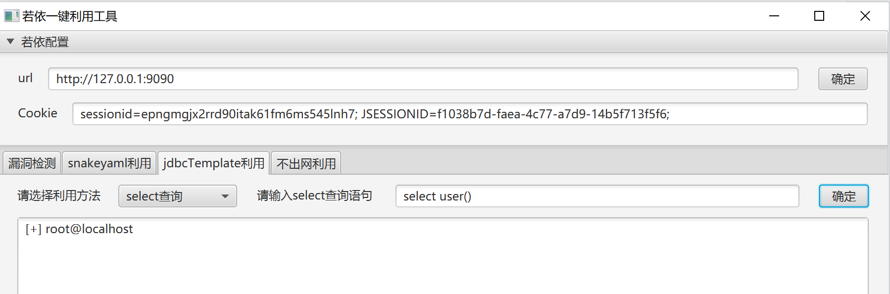
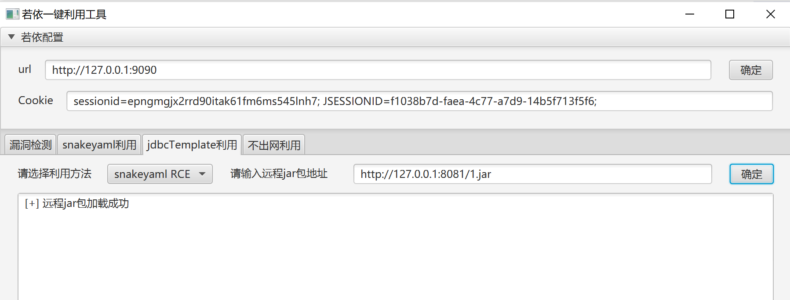
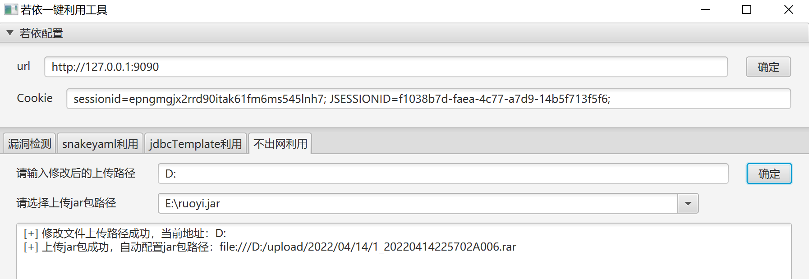
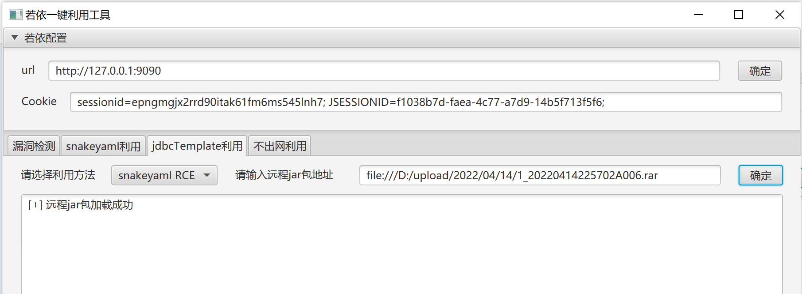
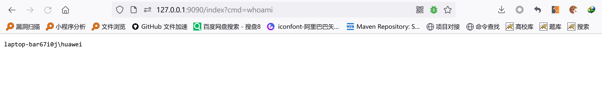

前几天审的若依的后台定时任务黑名单绕过漏洞，整合了一个小工具，提供了几个功能：

- 低版本直接snakeyaml rce
- 高版本利用jdbcTemplate执行sql语句，在 。师傅的提醒下可以绕过括号限制，并采用 set 和 execute 做到任意sql语句执行，目前提供 select单字段回显与执行update语句
- 高版本利用jdbcTemplate绕过黑名单限制实现snakeyaml rce
- 对于不出网主机，由于URLClassLoader只是加载字节流，对于文件名后缀没有要求且可以 file:// 协议传输，故可采用修改上传路径+上传jar包至本地方式，直接加载本地jar注入内存马，jar包上传后自动载入配置，可直接进入其他模块使用

**效果如下：**

- 漏洞检测

  

* snakeyaml RCE：

  

- 执行sql语句：

  

- 绕过黑名单限制：

  

- 不出网注入内存马：

  

  

  
